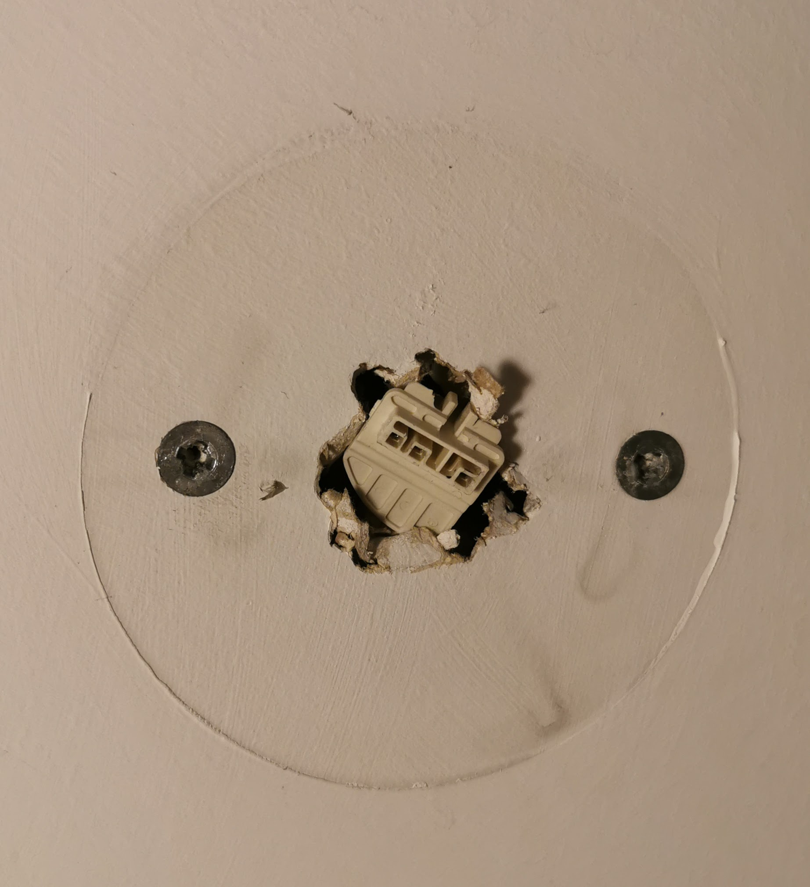
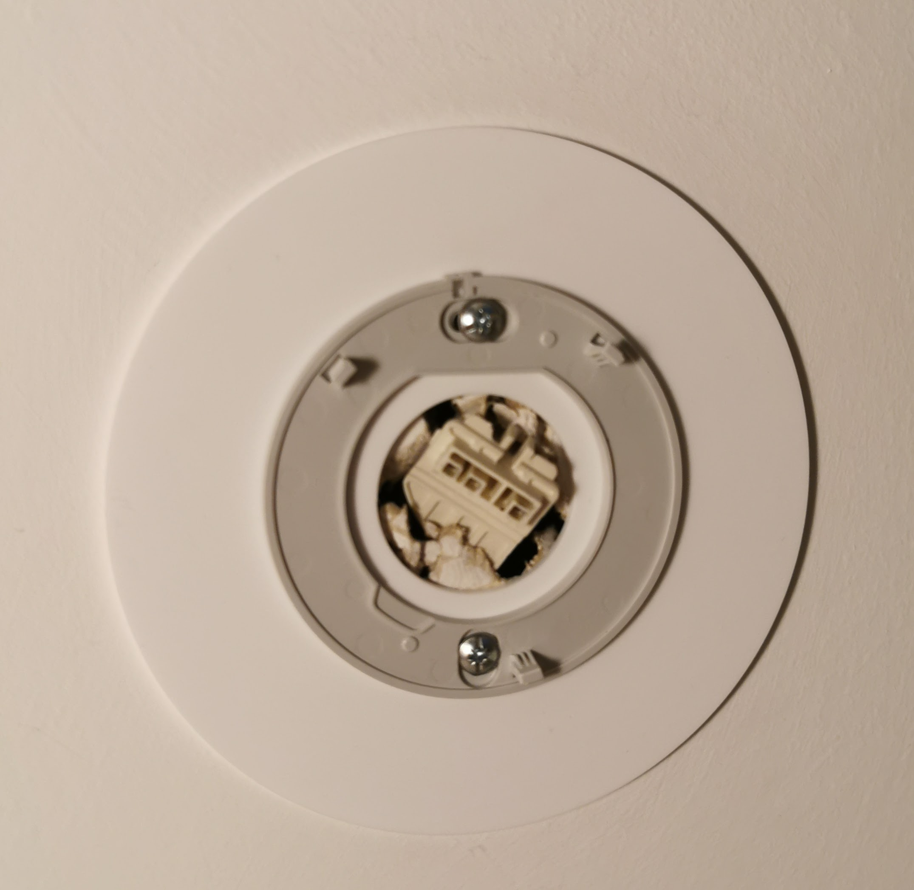
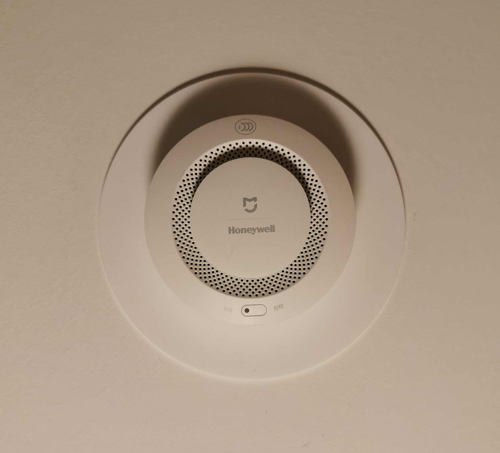
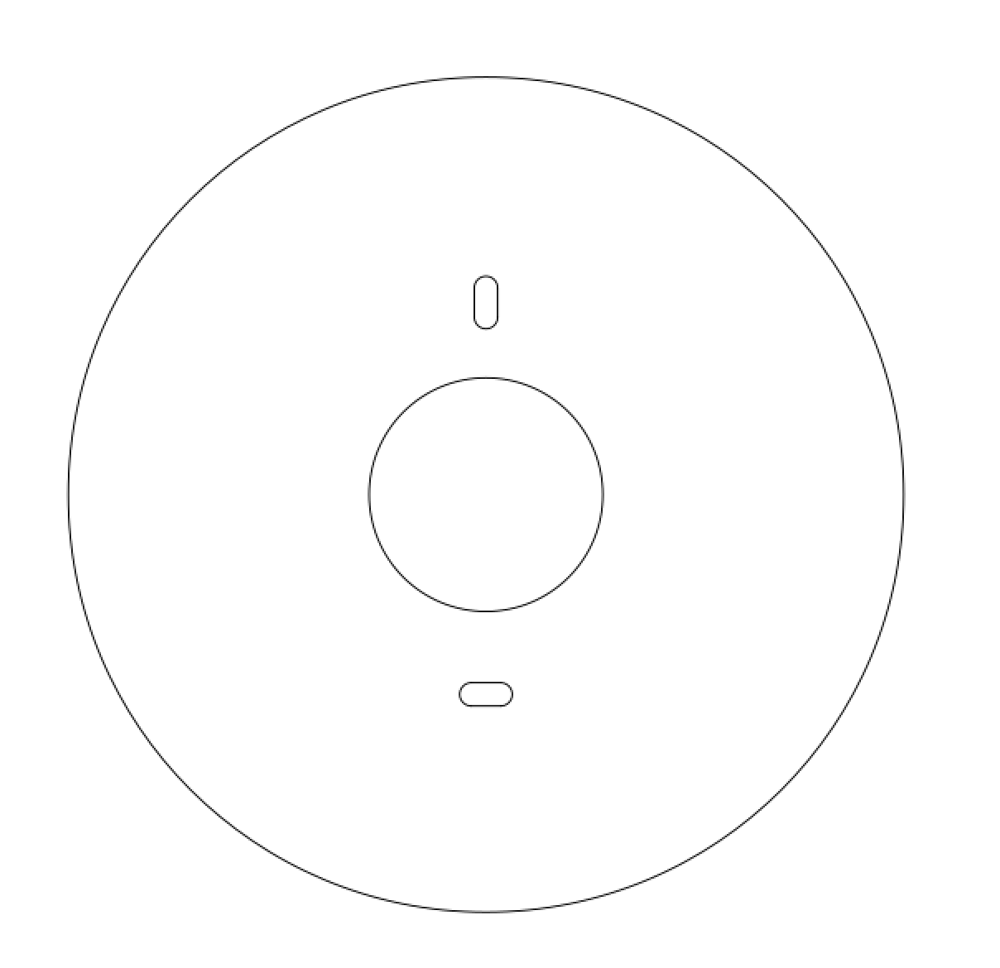

This is a mounting plate for the Xiaomi Mijia Honeywell Smoke Detector, the idea being it covers up any marks or paint differences when replacing an original, larger smoke alarm.

N.B I: The Xiaomi Mijia Honeywell Smoke Detector is not compliant with British safety standards, and warns that it's only for use in China & Hong Kong. I use it along side multiple, compliant smoke detectors to ensure adequate protection. 

N.B II: I had some issues when attempting to import a DXF created from the SVG file into the laser cutter. The dimensions were off and the circles became warped. If you experience these issues, I highly recommend using the DXF from this repository.

## Images

Before affixing the mount:  

After the bracket has been fixed:  

Completed:  

SVG:  

## Assembly

- Cut the mount out of ~3mm acrylic with a laser cutter.
- Place the original smoke detector bracket over the mount, and affix to ceiling.
- Twist smoke alarm onto bracket.

## Licence

This project is licensed under the [Creative Commons CC BY-NC-SA 4.0](https://creativecommons.org/licenses/by-nc-sa/4.0/) licence.

You are free to share and adapt the code as required, however you *must* give appropriate credit and indicate what changes have been made. You must also distribute your adaptation under the same license. Commercial use is prohibited.

## Acknowledgements

Big thanks to Liam who quickly reproduced the design after I had import issues, and the [London Hackspace](https://london.hackspace.org.uk/) for use of the Laser Cutter.

